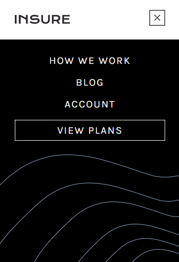

# Frontend Mentor - Insure landing page solution
  

### The challenge

Users should be able to:

- View the optimal layout for the app depending on their device's screen size
- See hover states for all interactive elements on the page

### Screenshot

Computer view

Mobile view

Mobile menu

### Built with

- HTML5
- CSS
- Javascript
- Flexbox

### What I learned

I used a lot of media queries to always have my picture positioned correctly.
This is also the first time I'm animating a menu, it's kinda cheesy but it was fun to make.